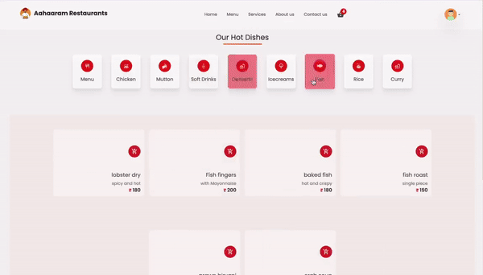

# 𝐀𝐚𝐡𝐚𝐚𝐫 𝐒𝐞𝐫𝐯𝐢𝐜𝐞𝐬

Aahar Restaurant is a full-stack web application built for booking food services. It allows users to browse through various restaurants, view menus, select items, and make reservations.

## Features

- **User Authentication:** Secure user authentication and authorization system to manage user accounts and access.
- **Browse Restaurants:** Users can browse through a list of available restaurants.
- **View Menus:** Detailed menus for each restaurant with item descriptions and prices.
- **Make Reservations:** Users can select items from the menu and make reservations for dining in.
- **Responsive Design:** The application is designed to work seamlessly across various devices and screen sizes.

## Screenshots and Demo

  

## Technologies Used

- **Frontend:** React.js, HTML, CSS, JavaScript
- **Backend:** Node.js, Express.js
- **Database:** Firebase
- **Authentication:** JSON Web Tokens (JWT)
- **Deployment:** Vercel

